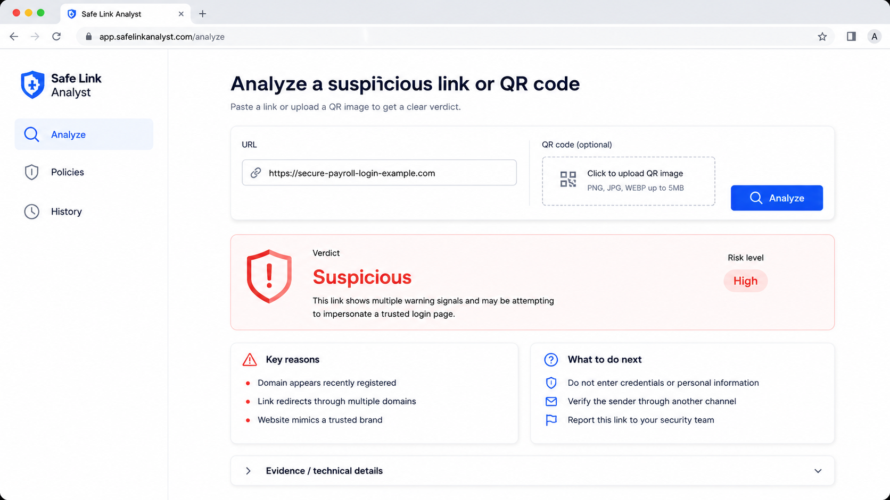

# Simplified Analyze UI Spec

Status: M1 implementation spec
GitHub issue: [#18](https://github.com/itprodirect/safe-link-project/issues/18)
Milestone: M1 - Simplified Analyze UI matching session mockup

## Product Goal

The simplified Analyze page should quickly answer:

> Is this URL or QR code safe, suspicious, or risky - and why?

M1 is a clarity milestone for the primary `/analyze` page. The goal is to make the
core product obvious without changing detection behavior, backend contracts, policy
behavior, history behavior, auth, or billing surfaces.

## Mockup Reference

Reference asset: `docs/assets/simple-analyze-ui-mockup.png`



The screenshot represents the analyzed/result state. It is not necessarily the
blank initial state, and the suspicious example URL should not be prefilled by
default unless a later issue deliberately adds demo/sample behavior.

## Source Context

This spec is based on the M1 GitHub issue sequence and current repository state:

- M1 child Issue #1, GitHub #18: Create simplified Analyze UI spec from session
  mockup.
- M1 child Issue #2, GitHub #19: Simplify Analyze page shell and input card.
- M1 child Issue #3, GitHub #20: Simplify Analyze result cards.
- M1 child Issue #4, GitHub #21: Harden Analyze page states and accessibility.
- M1 child Issue #5, GitHub #22: Document local runbook for simplified Analyze UI.
- Claude Code review noted that the current `/analyze` route is a tabbed,
  dual-mode workspace, while the M1 target is a simplified single-purpose flow.
- Current docs and code show URL/email/QR analysis is already supported, but M1
  should subtract surface area from `/analyze` rather than add new backend behavior.

## Initial State And Analyzed State

### Initial State

The initial `/analyze` state should show:

- Simple left sidebar with Safe Link Analyst branding.
- `Analyze` as the active sidebar item.
- `Policies` and `History` visible as inert or coming-soon placeholders.
- Main heading: `Analyze a suspicious link or QR code`.
- Helper text: `Paste a link or upload a QR image to get a clear verdict.`
- Blank URL input with a clear label.
- Optional QR upload area if QR upload remains supported from this route.
- One `Analyze` button.
- Simple guidance instead of result cards, for example a quiet empty state that
  tells users to paste a link or upload a QR image.

The initial state should not show Email input, policy controls, allowlist controls,
network controls, raw JSON, analyst filters, or a mode toggle.

### Analyzed State

After a successful URL or QR analysis, the page should follow the mockup hierarchy:

1. Input card stays above the result so the user can run another analysis.
2. Large verdict card becomes the primary result.
3. Risk level pill is visible inside or adjacent to the verdict card.
4. Plain-English explanation appears in the verdict card.
5. `Key reasons` card shows the top reasons for the verdict.
6. `What to do next` card shows the top user actions.
7. `Evidence / technical details` is collapsed by default.

Technical details remain available, but they should no longer compete with the
primary verdict.

## Simplified Page Structure

### Left Sidebar

The left sidebar should contain:

- Safe Link Analyst branding.
- `Analyze` as the active item.
- `Policies` as an inert or coming-soon placeholder.
- `History` as an inert or coming-soon placeholder.

M1 must not wire `Policies` to E5 policy UI and must not wire `History` to E6
history behavior.

### Main Header

Use this copy:

- Heading: `Analyze a suspicious link or QR code`
- Helper text: `Paste a link or upload a QR image to get a clear verdict.`

### Input Card

The input card should contain:

- URL input with a clear visible label: `URL`.
- Optional QR upload area if current QR support remains available from `/analyze`.
- One primary button with accessible name `Analyze`.

The simplified card should remove the current URL/email/QR tabs, Quick/Analyst
mode toggle, allowlist controls, network controls, email headers form, and retry
surface from the primary path.

### Result Area

The result area should contain:

- Verdict card.
- Risk level pill.
- Plain-English explanation.
- `Key reasons` card.
- `What to do next` card.
- Collapsed `Evidence / technical details` accordion.

Use the existing family summary, finding, analyst, and evidence payloads to fill
these sections. Do not require a new risk engine or backend response shape.

## Settled Product Decisions

### 1. Email

Hide Email from the simplified `/analyze` surface for M1.

Do not delete backend/email capability. Preserve any legacy `/email` route and
existing email API smoke behavior if present. Email can remain test-covered as a
separate legacy validation path, but it should not appear in the M1 simplified
Analyze page.

### 2. Verdict Vocabulary

Reuse existing action/severity logic. Do not create a new risk engine.

Current source of truth:

- `ui/app/analyze/result-panels.tsx` derives the action level from
  `family.risk_score`, `result.overall_risk`, and `family.severity` or
  `result.overall_severity`.
- The backend source of truth remains the existing orchestrator/scoring and
  response payloads returned by `POST /api/v2/analyze` and `POST /api/v1/qr/scan`.

Recommended M1 display mapping:

| Existing action | Verdict label | Risk label |
|---|---|---|
| `safe` | `Safe` | `Low` |
| `caution` | `Caution` | `Medium` |
| `avoid` | `Suspicious` | `High` |
| `block` | `Dangerous` | `Critical` |

If backend severity and UI action level disagree, preserve the current risk/action
derivation and map display labels from that existing source rather than changing
scoring semantics.

### 3. Policies And History

Show `Policies` and `History` as inert or coming-soon sidebar placeholders for M1.

Do not add a policy selector, policy drawer, policy CRUD, policy dry-run, policy
audit surface, history list, compare view, rerun flow, or feedback persistence in
this milestone.

### 4. Single Analyze Button Routing

The simplified page has one `Analyze` button:

| Input state | Behavior |
|---|---|
| URL only | Call the URL analyze flow through `POST /api/v2/analyze`. |
| QR file only | Call the QR scan flow through `POST /api/v1/qr/scan`. |
| URL and QR file | Show a validation message asking the user to choose one input type. |
| Empty URL and no QR file | Show a validation message. |

Validation messages should be inline and readable by assistive technology. They
should not clear a previous successful result unless the user starts a new valid
analysis request.

## Current Repo Component And File Map

Likely follow-up edit points:

| File | Current role | Likely M1 follow-up work |
|---|---|---|
| `ui/app/layout.tsx` | Global shell and top navigation for all UI pages. | Decide whether simplified sidebar is page-local to `/analyze` or requires shell changes. Prefer page-local unless broader navigation intentionally changes. |
| `ui/app/analyze/page.tsx` | Main `/analyze` client page. It currently owns URL/email/QR tabs, Quick/Analyst mode, form state, validation, API calls, loading/error state, retry behavior, and layout. | Primary file for M1 Issue #2 / GitHub #19 shell/input simplification and single-button routing. |
| `ui/app/analyze/result-panels.tsx` | Result presentation. It currently owns verdict/action mapping, Quick result, Analyst result, domain anatomy, redirect path, suppression trace, evidence filtering, raw JSON fallback, and empty state. | Primary file for M1 Issue #3 / GitHub #20 result-card simplification and collapsed technical details. |
| `ui/app/globals.css` | Global and Analyze-specific styles. | Update layout, sidebar, input card, verdict cards, pills, two-card reasons/actions grid, and accordion styling. |
| `ui/lib/api.ts` | Typed frontend client for `POST /api/v2/analyze`, `POST /api/v1/qr/scan`, wrapped items, family payloads, and analyst payloads. | Keep API helpers and types. Only change if simplified routing needs a tiny helper; avoid contract changes. |
| `ui/e2e/analyze.smoke.spec.ts` | Browser smoke for current URL, email, and QR tab flows. | M1 Issue #2 / GitHub #19 must update this to the simplified shell/input flow and keep smoke e2e green. |
| `ui/e2e/analyze.verdict.spec.ts` | Mocked verdict/analyst presentation tests. | M1 Issue #3 / GitHub #20 must update this for simplified result cards and collapsed evidence behavior. |

Components currently live inline in `ui/app/analyze/page.tsx` and
`ui/app/analyze/result-panels.tsx`. Do not introduce a new component folder unless
the implementation becomes hard to review without extracting repeated page-local
pieces. A small same-folder extraction is acceptable if it reduces real complexity,
but it is not a requirement of M1.

## Data And API Assumptions

M1 should preserve existing API behavior:

- Preserve `POST /api/v2/analyze` for URL analysis.
- Preserve `POST /api/v1/qr/scan` for QR upload and scan behavior.
- Preserve family summaries, analyst payloads, evidence rows, suppression traces,
  and wrapped response handling.
- Preserve backend behavior and contract tests.
- Preserve legacy `/email` route and email API smoke behavior if present.
- Continue to request `family=true` for user-facing verdict copy.
- Use existing `item.family.reasons`, finding explanations, and
  `item.family.recommendations` for the `Key reasons` and `What to do next`
  cards before inventing new UI-only copy.
- QR decoder dependencies may be unavailable locally or in CI. QR tests should
  tolerate known decoder-unavailable or multipart-unavailable states, including
  `QRC_DECODER_UNAVAILABLE` and `QRC_MULTIPART_UNAVAILABLE`.

No backend model, scorer, API route, policy contract, or package dependency should
change for M1 simplified UI work unless a later issue explicitly broadens scope.

## Accessibility And Selector Strategy

Accessibility requirements:

- URL input has a clear label, preferably visible text `URL`.
- QR upload has a clear label, for example `QR code` or `QR image`.
- The primary button has accessible name `Analyze`.
- Validation messages are connected to the input area with `aria-live` or an
  equivalent accessible status/error pattern.
- Result cards have clear headings: `Verdict`, `Key reasons`,
  `What to do next`, and `Evidence / technical details`.
- The risk pill has a readable text label such as `Risk level High`.
- `Evidence / technical details` should use accessible collapsed/expanded
  behavior. Prefer native `details` and `summary` unless the repo has a stronger
  convention by implementation time.
- Focus order should move from sidebar to heading to input card to result area.
- Keyboard users should be able to operate URL input, file upload, Analyze button,
  and the evidence accordion without custom key handling.

Selector strategy:

- Prefer role, label, and heading locators for Playwright assertions:
  `getByRole("heading", { name: "Analyze a suspicious link or QR code" })`,
  `getByLabel("URL")`, and `getByRole("button", { name: "Analyze" })`.
- Add minimal stable `data-testid` hooks only where accessible names are expected
  to change during copy iteration. Suggested hooks:
  - `analyze-shell`
  - `analyze-input-card`
  - `analyze-validation-message`
  - `analyze-verdict-card`
  - `analyze-risk-pill`
  - `analyze-key-reasons`
  - `analyze-next-actions`
  - `analyze-technical-details`
- Avoid selectors tied to sample URLs, exact paragraph copy, CSS class names, or
  raw JSON structure unless the test specifically protects a contract.

## Test Strategy By Follow-Up Issue

### M1 Issue #2 / GitHub #19: Simplify Analyze Shell And Input Card

- Remove the URL/Email/QR tabbed primary surface from `/analyze`.
- Hide Email from `/analyze` while preserving legacy email behavior elsewhere.
- Add the simplified sidebar, heading, helper text, blank URL input, optional QR
  upload area, and one Analyze button.
- Implement single-button validation/routing.
- Update `ui/e2e/analyze.smoke.spec.ts` in the same issue.
- Keep smoke e2e green.

### M1 Issue #3 / GitHub #20: Simplify Analyze Result Presentation

- Replace current Quick/Analyst result hierarchy with the mockup hierarchy.
- Keep existing action/severity derivation and apply the display mapping in this
  spec.
- Show verdict card, risk pill, plain-English explanation, `Key reasons`,
  `What to do next`, and collapsed technical details.
- Update `ui/e2e/analyze.verdict.spec.ts` in the same issue.
- Keep verdict e2e green.

### M1 Issue #4 / GitHub #21: Harden States, Accessibility, And Tests

- Harden empty, loading, validation, API error, decoder-unavailable, and success
  states.
- Verify keyboard and screen-reader semantics.
- Add viewport coverage and final selector cleanup.
- This issue is not the first place tests get fixed; M1 Issue #2 / GitHub #19
  and M1 Issue #3 / GitHub #20 must update their directly affected tests.

### M1 Issue #5 / GitHub #22: Local Runbook And Closeout

- Document local run commands, smoke flow, known QR decoder caveats, and M1
  closeout evidence.
- Confirm the simplified page remains bounded to Analyze page clarity.

## Validation Commands

For this docs/spec issue:

```bash
git diff --check
```

Run a markdown formatting check if one is available in the repo or local
environment.

For later code issues, likely UI validation commands from `ui/` are:

```bash
npm run lint
npm run typecheck
npm run build
npm run start:smoke
npm run smoke:e2e
npx playwright test e2e/analyze.verdict.spec.ts
```

`npm run start:smoke` is a long-running server command. Run it in one terminal
before running browser smoke commands from another terminal.

## Explicit Non-Goals

- No policy selector.
- No policy CRUD.
- No dry-run/audit.
- No history/compare.
- No auth.
- No dashboards.
- No billing/subscription UI.
- No backend behavior changes.
- No package/dependency changes.
- No new risk engine.
- No removal of backend/email capability.
- No deletion of legacy validation routes solely for M1.

## Follow-Up Issue Sequence

1. M1 Issue #2 / GitHub #19: Simplify Analyze shell and input card.
2. M1 Issue #3 / GitHub #20: Simplify Analyze result presentation.
3. M1 Issue #4 / GitHub #21: Harden states/accessibility/tests.
4. M1 Issue #5 / GitHub #22: Local runbook and closeout.

Recommended next issue after this spec lands: M1 Issue #2 / GitHub #19, because
it establishes the simplified shell, blank initial state, and single Analyze
button routing that the result-card work should build on.
